---
lab:
    title: 'ラボ 7 – 高可用性とディザスター リカバリー環境の計画と実装'
    module: '高可用性とディザスター リカバリー環境の計画と実行'
---

# ラボ 7 – 高可用性とディザスター リカバリー環境の計画と実装

**予想時間**: 90 分

**前提条件**: 演習 1 で使用した Azure SQL Database は、モジュール 3 のラボで作成されました。 

**ラボ ファイル**: このラボのファイルは、D:\Labfiles\High Availability フォルダーにあります。

# ラボの概要

学生は 2 つの主要なタスクを実行します。Azure SQL Database を地理的に冗長化することと、Azure を使用する URL にバックアップして復元することです。 

# ラボの目的

このラボを完了すると、次のことができるようになります。

- Azure SQL Database の geo レプリケーションを有効にする

- URL を使用して SQL Server データベースをバックアップおよび復元する


# シナリオ

前のラボで日常的なタスクを自動化したので、シニア データ エンジニアとして、データベース環境の IaaS と PaaS の両方の構成の可用性を向上させる必要があります。次の目標が課せられています。

- Azure SQL Database の geo レプリケーションを有効にして、データベースの可用性を向上させます。

- データベースを AzureのURL にバックアップし、人為的エラーが発生した後に復元します。


# 演習 1: Azure SQL Database の geo レプリケーションを有効にする

推定時間: 45 分

概要

学生は、モジュール 3 のラボで作成した Azure SQL Database の構成を変更して、高可用性を実現します。

シナリオ

WideWorldImporters 内の DBA として、Azure SQL Database の geo レプリケーションを有効にする方法を理解し、それが機能していることを確認し、ポータルを使用して別のリージョンに手動でフェールオーバーする方法を知っている必要があります。

前提条件

- 学生用に作成された Azure アカウント – ログイン (電子メール) とパスワードを提供する必要があります

- Azure SQL Database サーバーと事前作成されたデータベース

 

1. ブラウザー ウィンドウから Azure portal にログインしていない場合は、提供された Azure 資格情報を使用してログインします。

2. 次に示すように、メニューから SQL Database を選択します。

	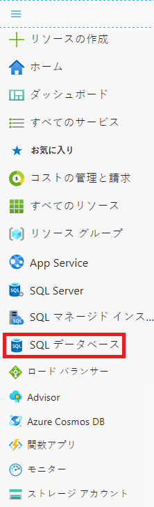

3. ラボ 3 で作成した Azure SQL Database をクリックします。次に例を示します。

	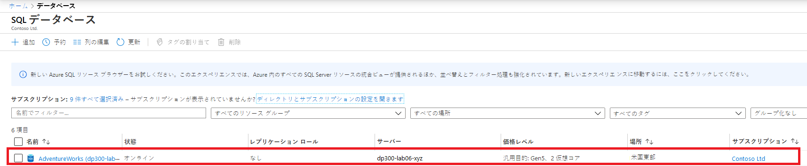

 

4. データベース ブレードの 「設定」 で 「geo レプリケーション」 を選択します。 

	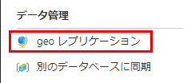

	データベースが現在構成されている領域は、以下のように、白いチェックマークの付いた青い六角形で表されています。geo レプリケーションが構成されていないことがわかります。

	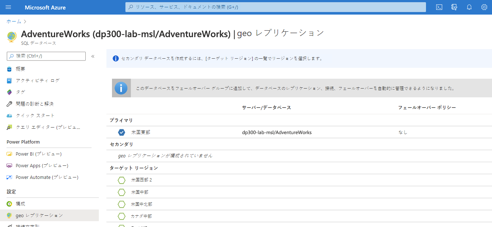

5. 「ターゲット リージョン」 を選択します。利用可能なすべてのリージョンは、緑色の輪郭の六角形になります。

	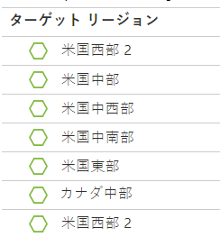

6. この例では、「セカンダリの作成」 ブレードに表示されているとおり、米国西部 2 が選択されています。ターゲット サーバーを選択します。

	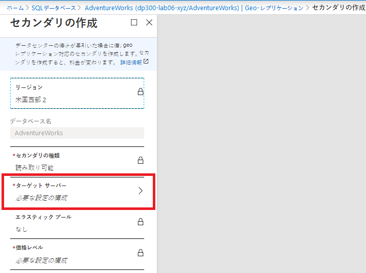

7. 「新しいサーバーの作成」 を選択します。「新しいサーバー」 ブレードで、module7geo の名前 (イニシャルまたは一意の接尾辞が付加されたもの)、有効な管理者ログイン、および安全なパスワードを入力します。これらの資格情報を書き留めておきます。完了したら、「選択」 をクリックします。

	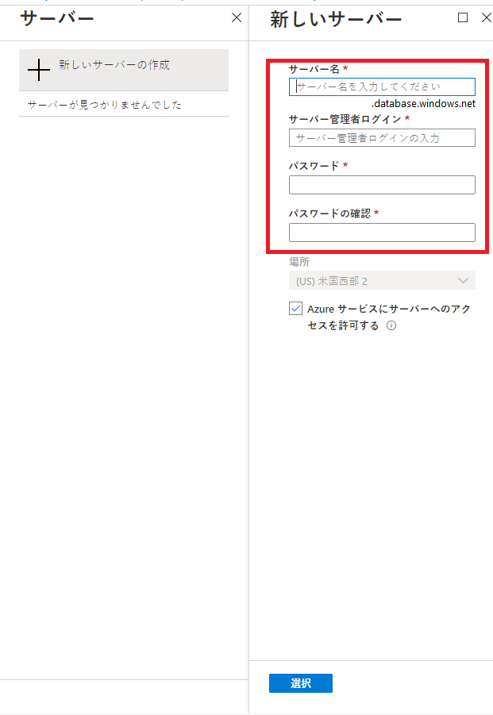

8. 「セカンダリの作成」 ブレードで 「**OK**」 をクリックします。セカンダリ サーバーとデータベースが作成されます。ステータスを確認するには、ポータル上部のベル アイコンの下を確認します。成功した場合、「デプロイ中」から「デプロイ成功」に進みます。 

	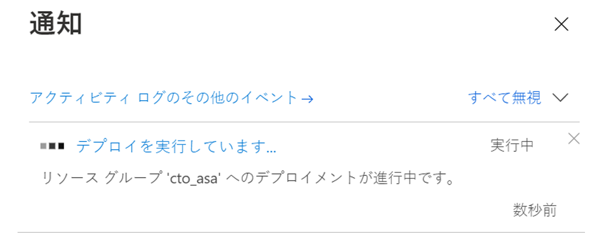


	また、geo レプリケーション ページで、セカンダリのステータス列で、ステータスが「初期化中」から、以下に示すように「シード完了率」になり、レプリケーションが同期されたときに「読み取り可能」になることがわかります。

	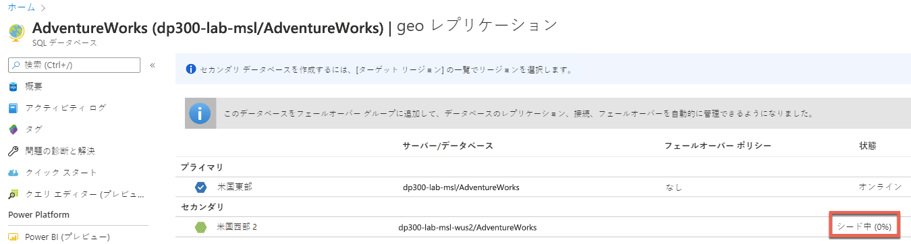

9. Azure SQL Database が geo レプリケーションで構成されたので、フェールオーバーを実行します。セカンダリ サーバーを選択します (前画像に示すように米国西部 2 ですが、別の地域を選択した可能性があります)。

10. ブレードで、「強制フェールオーバー」 をクリックします。

	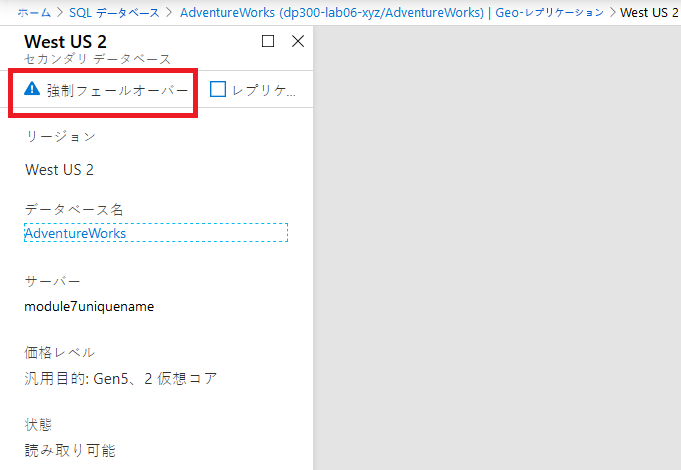

11. プロンプトが表示された場合は、「はい」 をクリックします。 

	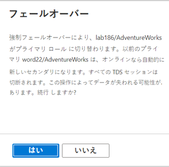


	プライマリ レプリカのステータスが 「保留中」、セカンダリ レプリカのステータスが 「フェールオーバー」に切り替わります。このプロセスには数分かかります。完了すると、ロールが切り替わり、セカンダリが新しいプライマリになり、古いプライマリがセカンダリになります。

	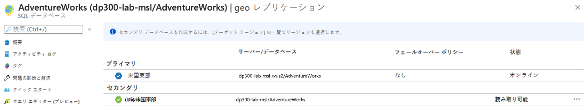


# 演習 2: URL へのバックアップと URL からの復元

推定時間: 45 分

この演習のタスクは次のとおりです。

- URL へのバックアップを構成する

- WideWorldImporters のバックアップ

- Restore WideWorldImporters

## タスク 1: URL へのバックアップを構成する

SQL Server のデータベースを Azure にバックアップする前に、いくつかの構成タスクを実行する必要があります。 

**注記:** ストレージ アカウント キーや共有アクセス署名などの複数の長い文字列が生成され、再利用されます。これらの文字列を保持するために使用するメモ帳ファイルをラボ VM 内で開くことを検討してください。 

1. コンテキストが LON-SQL 1 仮想マシンであることを確認します。

2. Edge を起動し、まだ入っていない場合は Azure portal ([https://portal.azure.com](https://portal.azure.com/)) にログインします。

3. 右上隅にある以下のアイコンを選択して、Cloud Shell プロンプトを開きます。

	

4. まだ Cloud Shell を使用していない場合は、ポータルの下半分に、Azure Cloud Shell へのウェルカム メッセージが表示される場合があります。Bash を選択します。

	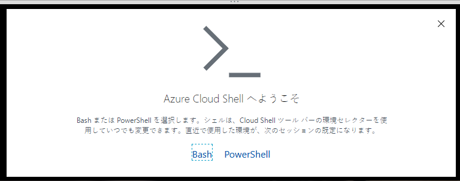

5. 以前に Cloud Shell を使用したことがない場合は、ストレージを提供する必要があります。下のダイアログで 「ストレージの作成」 をクリックします。

	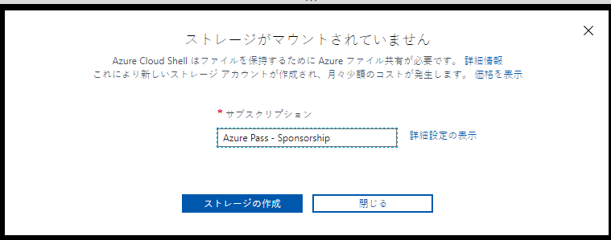


6. Cloud Shell をすでに使用している場合は、Cloud Shell 画面の上隅に Bash が表示されていることを確認してください。ドロップ ダウン矢印を使用して、PowerShell または Bash を選択できます。 
 

	完了すると、以下のようなプロンプトが表示されます。

	


7. Cloud Shell で次のコマンドをコピーして、CLI からストレージ アカウントを作成します。

	```
	az storage account create -n dp300storage -g DP-300-Lab02 --kind StorageV2 -l eastus2
	```

	コマンドを編集し、ストレージ アカウント名を一意にし、すべて小文字で特殊文字を使用しないようにします。上記の dp300storage を dp300storagemsl123 のような一意の名前に変更する必要があります。値 DP-300-Lab02 は既存のリソース グループの名前です。以前のラボで作成したものを使用してください。必要に応じて、リージョンを変更してください。Enter キーを押してコマンドを実行します。 


	次に、自分のアカウントのアカウント キーを取得します。これは、以降の手順で使用します。前のコマンドで使用したものと同じ名前 (-n の後) とリソース グループ (-g の後) を使用するように編集した後、Cloud Shell で以下のコードを実行します。

	```
	az storage account keys list -g DP-300-Lab02 -n dp300storage
	```

	アカウント キーは上記のコマンドの結果に含まれます。次に示すように、key1 の戻り値 (二重引用符なし) をコピーしてください。メモ帳に保存することもできます。 


	
 

8. SQL Server のデータベースを URL にバックアップするには、ストレージ アカウントとその中のコンテナーを使用します。この手順では、バックアップ ストレージ専用のコンテナーを作成します。これを行うには、次のコマンドを実行します。ここで、dp300storage はストレージ アカウントの作成時に使用されるストレージ アカウント名であり、storage_key は上記で生成されたキーです。

	```
	az storage container create --name "backups" --account-name "dp300storage" --account-key "storage_key" --fail-on-exist
	```
 
	出力は true を返すはずです。

	


9. コンテナーのバックアップが作成されたことをさらに確認するには、次のコマンドを実行します。ここで、dp300storage は作成したストレージ アカウント名、storage_key は上記で生成したキーです。 

	```
	az storage container list --account-name "dp300storage" --account-key "storage_key"
	```

	出力の一部は以下のようなものを返すはずです。

	


10. セキュリティのために、コンテナー レベルの Shared Access Signature (SAS) が必要です。これは、Cloud Shell または PowerShell を介して実行できます。以下を実行します。ここで、dp300storage は上記で作成したストレージ アカウント名、storage_key は上記で生成されたキー、date_in_the_future は現在より後の時間です。date_in_the_future は UTC でなければなりません。例は 2020-10-31T00:00Z で、2020 年 10 月 31 日の午前 0 時に期限切れになります:

	```
	az storage container generate-sas -n "backups" --account-name "dp300storage" --account-key "storage_key" --permissions "rwdl" --expiry "date_in_the_future" -o tsv
	```
	

	出力は、次のタスクで使用される以下のような値を返すはずです。以前に保存したキーとともに、値をコピーしてメモ帳に保存できます。 

	


## タスク 2: WideWorldImporters のバックアップ

これで機能が構成されたので、Azure で BLOB としてバックアップ ファイルを生成できます。 

1. SQL Server Management Studio を開き、LON-SQL1 に接続されていることを確認します。

2. 「新しいクエリ」 をクリックします。

3. 次の Transact-SQL を使用して、クラウド内のストレージにアクセスするために使用される資格情報を作成します。適切な値を入力します。ここで、dp300storage はタスク 1 の手順 8 で作成されたストレージ アカウント名であり、sas_token はタスク 1 の手順 10 で生成された値です。 

	```sql
	IF NOT EXISTS 

	(SELECT * FROM sys.credentials 

	WHERE name = 'https://dp300storage.blob.core.windows.net/backups') 

	BEGIN

	CREATE CREDENTIAL [https://dp300storage.blob.core.windows.net/backups]

	WITH IDENTITY = 'SHARED ACCESS SIGNATURE',

	SECRET = 'sas_token'

	END;

	GO 
	```
	

4. 「実行」 をクリックします。これは成功するはずです。

5. Transact-SQL で次のコマンドを使用して、データベース WideWorldImporters を Azure にバックアップします。
	```sql
	BACKUP DATABASE WideWorldImporters 

	TO URL = 'https://dp300storage.blob.core.windows.net/backups/WideWorldImporters.bak';

	GO 
	```
	ここで、dp300storage は、タスク 1 で使用したストレージ アカウント名です。

	成功すると、次のようなメッセージが表示されます。

	データベース「WideWorldImporters」、ファイル「WWI_Primary」の 1240 ページをファイル 1 で処理しました

	ファイル 1 のデータベース「WideWorldImporters」、ファイル「WWI_UserData」の 53104 ページを処理しました

	データベース「WideWorldImporters」、ファイル1のファイル「WWI_InMemory_Data_1」の 3865 ページを処理しました

	データベース「WideWorldImporters」、ファイル1のファイル「WWI_Log」の 1468 ページを処理しました。

	BACKUP DATABASE は 14.839 秒 (31.419 MB/秒) で 59677 ページを正常に処理しました。

	Completion time: 5/18/2020 8:01:41 AM

	

	何かが正しく構成されていない場合は、次のようなエラー メッセージが表示されます。

	メッセージ 3201、レベル 16、状態 1、行 33  
	バックアップ デバイス 'https://dp300storage.blob.core.windows.net/container_name/WideWorldImporters.bak' を開けません。オペレーティング システム エラー 50 (要求はサポートされていません。)。  
	Msg 3013, Level 16, State 1, Line 33  
	BACKUP DATABASE が異常終了しています。


	入力ミスがないこと、すべてが正常に作成されていることを確認してください。

6. ファイルが実際に Azure にあることを確認するには、Storage Explorer または Azure Cloud Shell を使用できます。Bash の構文は次のとおりです。ここで、dp300storage はタスク 1 で使用されるストレージ アカウント名であり、storage_key はそこでも使用されるキーです。 
	```
	az storage blob list -c "backups" --account-name "dp300storage" --account-key "storage_key"
	```
	
	出力例を以下に示します。

	

 
## タスク 3: Restore WideWorldImporters

このタスクでは、データベースを復元する方法を示します。


1. SQL Server Management Studio で、「新しいクエリ」 ウィンドウをクリックして以下を実行します。 
	```sql
	USE WideWorldImporters;
	GO
	
	```

2. 次のステートメントを実行して、CustomerID が 1 の Customers テーブルの最初の行を返します。顧客の名前を書き留めます。
	```sql
	SELECT TOP 1 * FROM Sales.Customers;
	GO
	
	```
	
3. このコマンドを実行して、その顧客の名前を変更します。
	```sql
	UPDATE Sales.Customers
	SET CustomerName = 'This is a human error'
	WHERE CustomerID = 1;
	GO
	
	```

4. 手順 2 を再実行して、名前が変更されたことを確認します。ここで、誰かが WHERE 句なしで数千または数百万の行を変更したか、間違った WHERE 句があるかを想像してください。

5. データベースを復元して、手順 3 で行った変更前の状態に戻すには、次のコマンドを実行します。ここで、dp300storage はタスク 1 で使用したストレージ アカウント名です。

	```sql
	USE master;
	GO

	RESTORE DATABASE WideWorldImporters 
	FROM URL = 'https://dp300storage.blob.core.windows.net/backups/WideWorldImporters.bak';
	GO
	```

	出力は次のようになります。

	データベース「WideWorldImporters」、ファイル「WWI_Primary」の 1240 ページをファイル 1 で処理しました

	ファイル 1 のデータベース「WideWorldImporters」、ファイル「WWI_UserData」の 53104 ページを処理しました

	データベース「WideWorldImporters」、ファイル1のファイル「WWI_Log」の 1468 ページを処理しました。

	データベース「WideWorldImporters」、ファイル1のファイル「WWI_InMemory_Data_1」の 3865 ページを処理しました

	RESTORE DATABASE は、59,677 ページを 16.167 秒 (28.838 MB/秒) で正常に処理しました。

	Completion time: 2020-05-18T08:35:06.6344123+00:00

6. WideWorldImporters の復元が完了したら、手順 1 と 2 を再実行します。データは元に戻ります。
